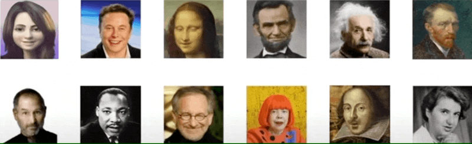

# AI-generated-characters for Learning and Wellbeing
Click [here](https://www.media.mit.edu/projects/Ai-generated-characters/overview/) for the full project page.

This repository contains the source code for the paper [AI-generated characters for supporting personalized learning and well-being](https://www.nature.com/articles/s42256-021-00417-9) by Pat Pataranutaporn, Valdemar Danry, Joanne Leong, Parinya Punpongsanon, Dan Novy, Pattie Maes & Misha Sra. This repository is a combination previous work on AI generated characters that include [Siarohin et al.](https://github.com/AliaksandrSiarohin/first-order-model), [Prajwal et al.](https://github.com/Rudrabha/Wav2Lip), and [Corentin](https://github.com/CorentinJ/Real-Time-Voice-Cloning).

## Examples of Outputs

With the pipeline, one can easily create a video of AI-generated characters from Video, Audio, and Text input (text is coming soon).

## Colab Demo 
The code is available on google-colab. See: ```AI_Generated_Characters.ipynb```. To run press ```Open In Colab``` button. 
[](https://colab.research.google.com/drive/1y0YigI1RiTVd2Qr6HHpesAwYoovcvZaE?usp=sharing)


